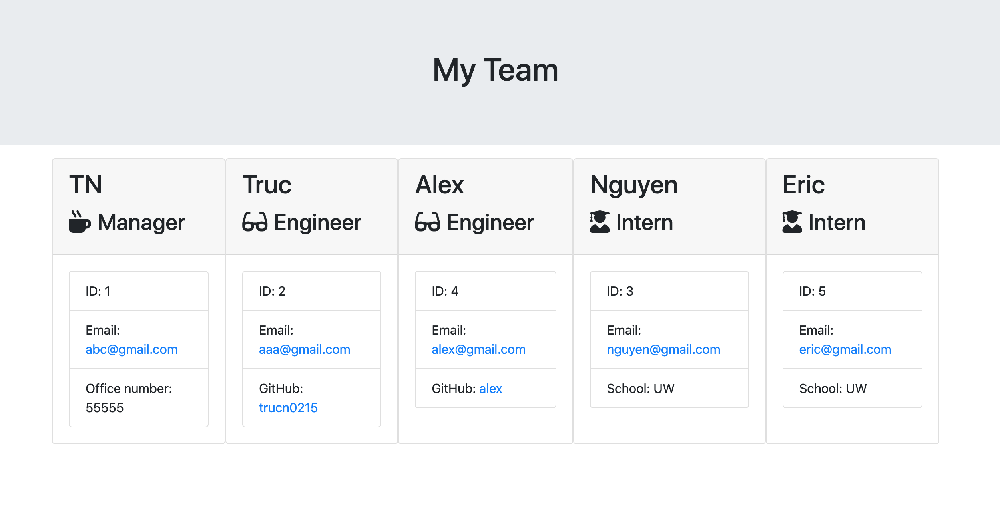

# TN-Profile-Generator-App
- - - -
## User Story
```
As a manager
I want to generate a webpage that displays my team's basic info
so that I have quick access to emails and GitHub profiles
```

## Application Description
The application will prompt the user for information about the team manager and then information about the team members. The user can input any number of team members, and they may be a mix of engineers and interns. This assignment must also pass all unit tests. When the user has completed building the team, the application will create an HTML file that displays a nicely formatted team roster based on the information provided by the user

## Technical Usage
    - Jest: To testing the code
    - Inquire: To Promt user information
    - fs: To generate HTML files
    - Bootstrap: To styling the page
    - fontawesome: To import new font styles

## Link
[Click here for Repo Link](https://github.com/trucn0215/TN-Team-Profile-Generator-App)

## Demo
[Click here for Demo Video](https://youtu.be/XihSMs8ZjW4)

## Screenshoot of generated Team Page
